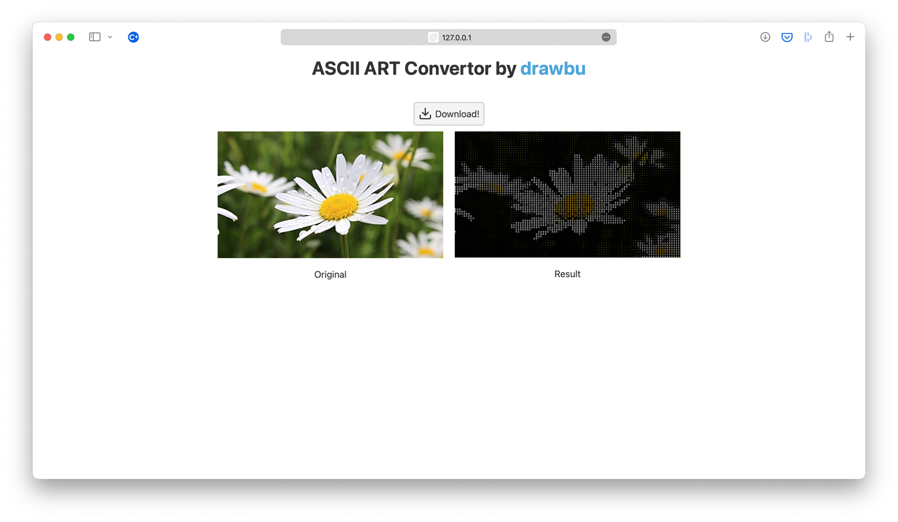

# ASCII ART Convertor



This project is a web server to host a full stack website that converts Images 
given by a user to ASCII ART images.

The project uses a Flask x Gunicorn back-end server, and Svelte for the front.

You can see a live example on [ascii.drawbu.dev](https://ascii.drawbu.dev).

## Installation

### Nix

If you have [nix](https://nixos.org), you can use the following:

```bash
nix build
```

Nix provide a `ascii-server` script in the result/bin folder
to run the server, provided a path to the socket file.

You can also directly use `nix run path/to/repo#server -- [sock]`.

### Make

**Note:** If you have the make utility, you can use the following:
```bash
make
```

### Other

**Or**, you can do the setup manually: <br>
Set up the back-end:
```bash
pip install -r requirements.txt
gunicorn wsgi:app
```

Set up the front-end:
```bash
cd client
npm install
npm run autobuild
```
